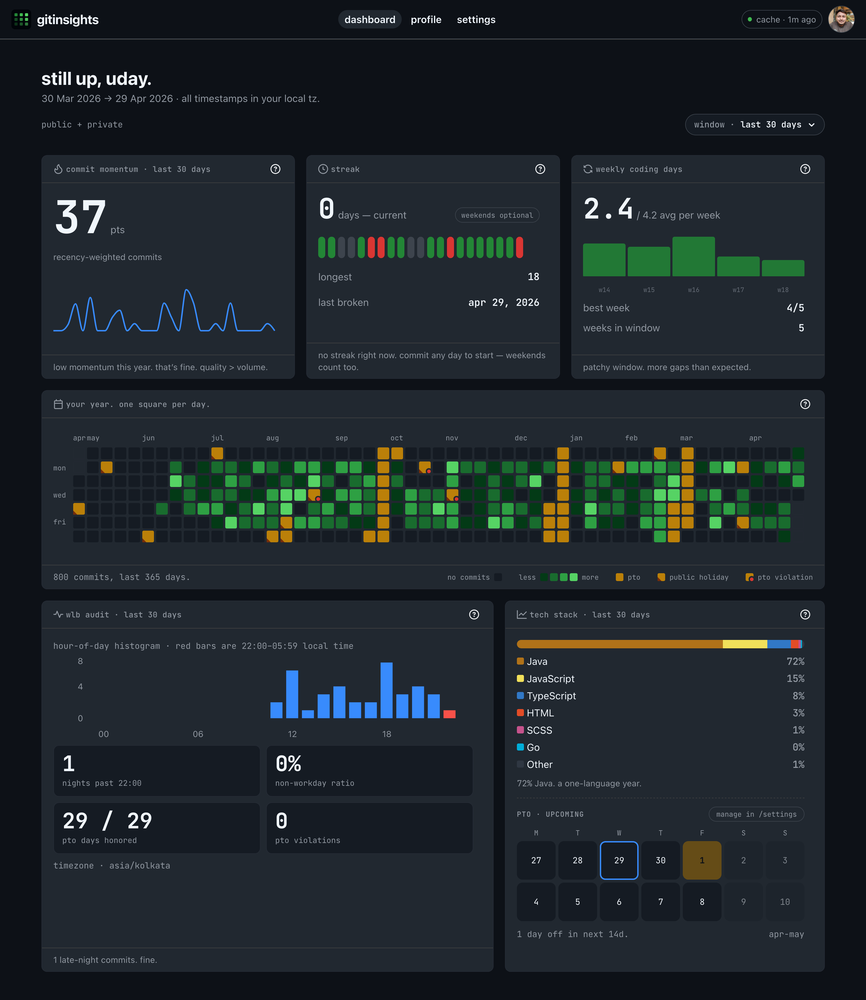

# gitInsights

**Your commits, your story. Not your boss’s dashboard.**

gitInsights is a zero-server developer identity dashboard: GitHub OAuth in the browser, analytics and caching on your machine, optional private-gist sync if you want the same settings on another device. No productivity theater, no manager-facing KPIs — see [spec voice & principles](docs/spec.md#10-voice--copy).



## What we read vs where it lives

| What | Where it lives |
| --- | --- |
| GitHub profile, org membership, repos, commits, emails (for author matching) | Fetched with your OAuth token; responses cached in IndexedDB `gi.rq-cache` |
| OAuth access token | `localStorage` key `gi.auth.token` |
| Theme, PTO, holidays, tile layout, streak mode, workweek, sync prefs | IndexedDB `gi.user-data` (+ assorted `gi.*` keys in `localStorage`) |
| Optional cross-device backup | A **private** gist `gi.user-data.json` in **your** GitHub account — we never see it server-side |

Full plain-language disclosure: open **`/privacy`** in the deployed app (no login required).

## Run locally

```bash
nvm use            # Node 22 — see .nvmrc
npm install
cp .env.example .env.local
# Fill VITE_GITHUB_CLIENT_ID, VITE_PROXY_URL, VITE_OAUTH_REDIRECT_URI, optional VITE_CANONICAL_ORIGIN
npm run dev        # http://localhost:5173
```

OAuth callback for dev: register `http://localhost:5173/callback` on your GitHub OAuth App. Production uses `https://<you>.github.io/<repo>/callback` plus the same values in GitHub Actions secrets for deploy.

## Docs & roadmap

- Product spec: [docs/spec.md](docs/spec.md)
- Phased tasks: [docs/tasks/](docs/tasks/)
- Release notes (v0.1.0): [docs/releases/v0.1.0.md](docs/releases/v0.1.0.md)

## Scripts

| Script | Purpose |
| --- | --- |
| `npm run dev` | Vite dev server |
| `npm run build` | Typecheck + production bundle to `dist/` |
| `npm run preview` | Serve `dist/` locally |
| `npm run render-brand-assets` | Regenerate `public/og.png`, favicons (Playwright + `png-to-ico`) |
| `npm run fetch-holidays` | Refresh bundled holiday JSON (see script header for sources) |
| `npm run test` / `npm run test:e2e` | Vitest / Playwright |

## Deploy

GitHub Pages serves the Vite app from `dist/`; the OAuth code exchange runs on Vercel (`api/authenticate.ts`). Set `VITE_CANONICAL_ORIGIN` in production builds to your Pages origin (no trailing slash) so Open Graph and Twitter Card URLs are absolute — the deploy workflow sets this from the repository URL.

## License & credits

Licensed under the [MIT License](LICENSE).

Built with [Mantine](https://mantine.dev/), [Styled Components](https://styled-components.com/), [Recharts](https://recharts.org/), [Primer Primitives](https://primer.style/primitives/) / [Octicons](https://primer.style/octicons/), [TanStack Query](https://tanstack.com/query), [Zustand](https://zustand-demo.pmnd.rs/), [dayjs](https://day.js.org/), [Octokit](https://github.com/octokit), [Comlink](https://github.com/GoogleChromeLabs/comlink), and [idb-keyval](https://github.com/jakearchibald/idb-keyval). Monospace UI uses [JetBrains Mono](https://www.jetbrains.com/lp/mono/) via [@fontsource/jetbrains-mono](https://fontsource.org/fonts/jetbrains-mono).

Public holidays in `src/data/holidays/` are generated by `scripts/fetch-holidays.ts` from the [Nager.Date](https://date.nager.at/) Public Holidays API (most regions) and the [calendar-bharat](https://github.com/jayantur13/calendar-bharat) dataset for India, with filtering documented in that script.
